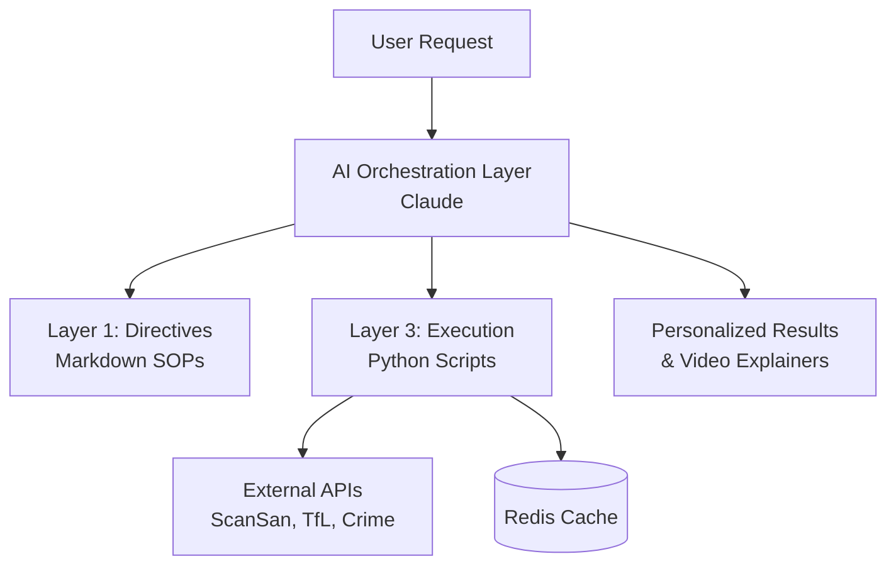

# RealTech-Hackathon
> AI-Powered Property Recommendation Engine with Intelligent Orchestration


## Description
RealTech-Hackathon is an intelligent housing recommendation platform designed to provide highly personalized area recommendations in London. It solves the problem of overwhelming property data by using a unique 3-layer AI orchestration architecture. The system synthesizes data from property intelligence, transport, crime, and education sources to give users a clear, data-driven understanding of candidate areas tailored to their specific lifestyle persona (e.g., student, parent, or developer).

## Table of Contents
- [Features](#features)
- [Tech Stack](#tech-stack)
- [Architecture Overview](#architecture-overview)
- [Installation](#installation)
- [Usage](#usage)
- [Configuration](#configuration)
- [API Reference](#api-reference)
- [Tests](#tests)
- [Roadmap](#roadmap)
- [Contributing](#contributing)
- [License](#license)
- [Contact](#contact)

## Features
- **Multi-Persona Intelligence**: Tailored recommendations for students, parents, and property developers.
- **Deep Data Enrichment**: Integrates ScanSan property scores, TfL commute times, crime safety data, and Ofsted school ratings.
- **AI Orchestration**: Uses an LLM layer to intelligently route requests, handle errors, and self-anneal directives.
- **Video Explainers**: Generates AI-powered video summaries of top recommendations for better mobile engagement.
- **Smart Scoring**: Ranks areas based on weighted preferences including budget, travel time, and local amenities.

## Tech Stack
- **Backend**: Python 3.9+, Claude API (Orchestration)
- **Data APIs**: ScanSan, TfL, GIAS (Schools), UK Police Data
- **Automation**: Custom 3-Layer AI Orchestration Framework
- **Video AI**: Veo, Sora, LTX (Fallback chain)
- **Data Processing**: Pandas, NumPy, aiohttp

## Architecture Overview

The system follows a 3-layer architecture where Markdown-based directives define the rules, the Claude-powered orchestrator manages logic and routing, and deterministic Python scripts perform the heavy data lifting and API interactions.

## Installation
1. Clone the repository:
   ```bash
   git clone https://github.com/younis-y/RealTech-Hackathon.git
   cd RealTech-Hackathon
   ```
2. Install Python dependencies:
   ```bash
   pip install -r requirements.txt
   ```
3. Set up environment variables:
   ```bash
   cp .env.template .env
   # Fill in your API keys in .env
   ```

## Usage
To fetch property intelligence for a specific area:
```bash
python scansan_api.py E1 SW1A
```
To run the full recommendation engine (requires CLI access):
```bash
# Example command
python orchestrate.py --persona student --budget 1000 --destination UCL
```

## Configuration
Configure the system via the `.env` file. Key variables include:
- `SCANSAN_API_KEY`: For property intelligence data.
- `ANTHROPIC_API_KEY`: For the Claude orchestration layer.
- `TFL_API_KEY`: For commute calculations.

## API Reference
The system provides several CLI tools and internal modules:
- `scansan_api.py`: Fetches affordability and yield scores.
- `schools_ofsted_fetcher.py`: Retrieves school ratings within a radius.
- `generate_video.py`: Handles the asynchronous video generation pipeline.

## Tests
Run the test suite using `pytest`:
```bash
pytest
```

## Roadmap
- [ ] Integration with real-time rental listings.
- [ ] Support for non-London UK cities.
- [ ] Mobile-native companion app.
- [ ] Enhanced flood risk and environmental data.

## Contributing
1. Fork the project.
2. Create your feature branch (`git checkout -b feature/AmazingFeature`).
3. Commit your changes (`git commit -m 'Add AmazingFeature'`).
4. Push to the branch (`git push origin feature/AmazingFeature`).
5. Open a Pull Request.

## License
Distributed under the MIT License. See `LICENSE` for more information.

## Contact
Maintainer: Younis Y - [GitHub](https://github.com/younis-y)
Project Link: [https://github.com/younis-y/RealTech-Hackathon](https://github.com/younis-y/RealTech-Hackathon)
