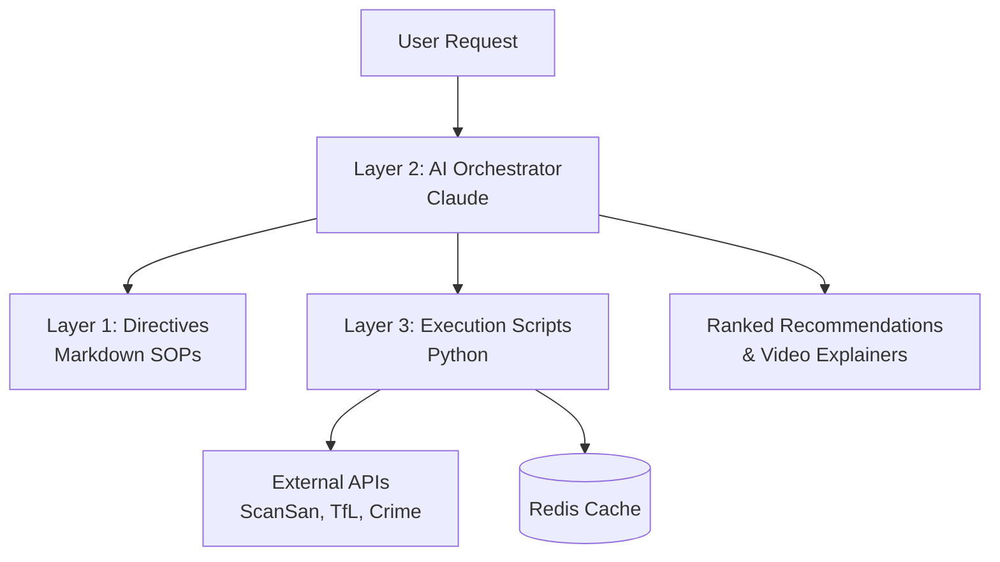

# RealTech-Hackathon
> AI-powered property recommendation engine with intelligent orchestration and multi-source data enrichment


## Description
RealTech-Hackathon is an intelligent property recommendation system that leverages a 3-layer AI orchestration architecture to generate highly personalised area recommendations for London property seekers. The platform synthesises live data from property intelligence, transport, crime statistics, and education ratings to provide clear, data-driven justifications for every recommendation.

The project is built on the **BLAST (Blueprint, Logic, Architecture, Scripts, Tools)** protocol, ensuring a robust and self-annealing system that can adapt to changing user needs and API environments.

## Table of Contents
- [Features](#features)
- [Tech Stack](#tech-stack)
- [Architecture Overview](#architecture-overview)
- [File Structure](#file-structure)
- [Installation](#installation)
- [Usage](#usage)
- [Configuration](#configuration)
- [Tests](#tests)
- [Roadmap](#roadmap)
- [Contributing](#contributing)
- [License](#license)
- [Contact](#contact)

## Features
- **3-Layer Orchestration**: Decoupled architecture separating high-level directives from deterministic execution scripts.
- **Persona-Driven Intelligence**: Tailored recommendations for students, parents, and property developers.
- **Multi-Source Enrichment**: Integrates ScanSan property scores, TfL commute times, UK crime data, and Ofsted ratings.
- **AI-Powered Video Explainers**: Generates narration-ready scripts and video assets for top area recommendations.
- **Self-Annealing Error Handling**: Orchestration layer that diagnoses and fixes API failures automatically.
- **Intelligent Scoring**: Weighted ranking engine based on user-defined priorities (budget, commute, safety, amenities).

## Tech Stack
- **Core**: Python 3.9+, Anthropic Claude API (Orchestration & Explanation)
- **Data Processing**: Pandas, NumPy, aiohttp (Async concurrency)
- **API Clients**: ScanSan Property Intelligence, TfL Unified API, UK Police Data API
- **Infrastructure**: Redis (Caching), structlog (Structured logging)
- **Environment**: python-dotenv for secret management

## Architecture Overview
The system follows a modular 3-layer design:

1.  **Layer 1: Directives (SOPs)**: Markdown-based Standard Operating Procedures that define how to process requests and fetch data.
2.  **Layer 2: Orchestration (Intelligence)**: An AI-powered decision-making layer (Claude) that reads directives and routes tasks.
3.  **Layer 3: Execution (Deterministic)**: Python scripts and tools that perform specific API calls and data processing.



## File Structure
- `directives/`: Markdown SOPs for schools, safety, amenities, and video generation.
- `execution/`: Deterministic Python scripts for API interaction and scoring.
- `tools/`: Core utilities for cache management and API verification.
- `MASTER_ORCHESTRATION.md`: The primary directive for the AI orchestration layer.
- `ARCHITECTURE.md`: Detailed system architecture documentation.
- `scansan_api.py`: Client for the ScanSan Property Intelligence API.

## Installation
1. Clone the repository:
   ```bash
   git clone https://github.com/younis-y/RealTech-Hackathon.git
   cd RealTech-Hackathon
   ```
2. Install dependencies:
   ```bash
   pip install -r requirements.txt
   ```
3. Set up environment variables:
   ```bash
   cp .env.template .env
   # Add your API keys to .env
   ```

## Usage
To fetch area intelligence:
```bash
python scansan_api.py E1 SW1A
```
To run the full recommendation engine (via Layer 2 Orchestration):
```bash
# Example command using the orchestration logic
python execution/score_and_rank.py --persona student --budget 1000
```

## Configuration
Configure the system via the `.env` file. Key variables:
- `ANTHROPIC_API_KEY`: Required for orchestration and explanation generation.
- `SCANSAN_API_KEY`: For property intelligence data.
- `TFL_API_KEY`: For travel time calculations.

## Tests
Run the test suite using `pytest`:
```bash
pytest
```

## Roadmap
- [ ] Integration with real-time rental listings (Rightmove/Zillow).
- [ ] Expansion to support major UK cities beyond London.
- [ ] Interactive Web Dashboard for area comparison.
- [ ] Support for non-narrated static video explainers.

## Contributing
Please see `CONTRIBUTING.md` (coming soon) for details on our code of conduct and the process for submitting pull requests.

## License
This project is licensed under the MIT License - see the `LICENSE` file for details.

## Contact
Maintainer: Younis Y - [GitHub](https://github.com/younis-y)
Project Link: [https://github.com/younis-y/RealTech-Hackathon](https://github.com/younis-y/RealTech-Hackathon)
