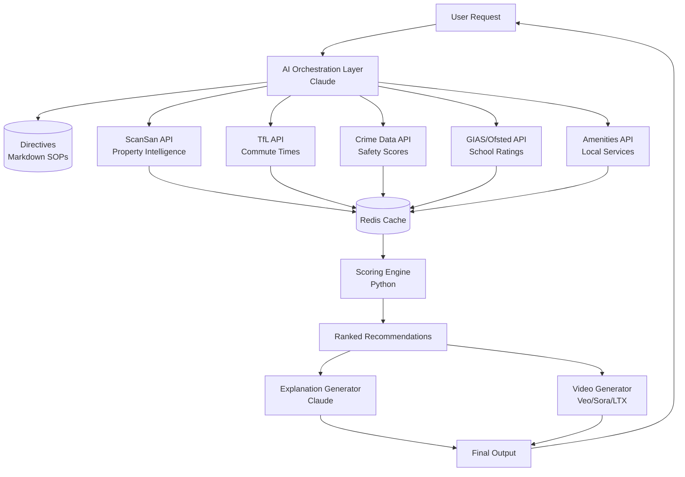

# RealTech-Hackathon
> AI-powered property recommendation engine with intelligent orchestration and multi-source data enrichment


## Description

RealTech-Hackathon is an intelligent property recommendation system that uses a 3-layer AI orchestration architecture to generate personalized area recommendations for UK property seekers. The system combines multiple data sources (property intelligence, transport, crime statistics, schools, amenities) and uses AI to score, rank, and explain recommendations tailored to different user personas (students, parents, developers).

Designed for property platforms, estate agents, and relocation services, the system solves the problem of information overload by automatically gathering, analyzing, and synthesizing vast amounts of location data into clear, actionable recommendations.

## Table of Contents

- [Features](#features)
- [Tech Stack](#tech-stack)
- [Architecture Overview](#architecture-overview)
- [Installation](#installation)
- [Usage](#usage)
- [Configuration](#configuration)
- [API Reference](#api-reference)
- [Tests](#tests)
- [Roadmap](#roadmap)
- [Contributing](#contributing)
- [License](#license)
- [Contact](#contact)

## Features

- **Multi-Persona Intelligence**: Tailored recommendations for students, parents, and property developers
- **Real-time Data Enrichment**: Fetches live data from ScanSan API, TfL, UK crime databases, and Ofsted
- **AI Orchestration Layer**: Intelligent routing and decision-making using LLM-powered orchestration
- **Smart Scoring Engine**: Weights and ranks areas based on user preferences and persona priorities
- **Video Explainers**: Generates AI video summaries using Veo/Sora/LTX for top recommendations
- **Natural Language Explanations**: Claude-powered narrative generation for each recommendation
- **Caching & Rate Limiting**: Efficient API usage with Redis caching and exponential backoff
- **Self-Annealing System**: Learns from failures and updates directives automatically

## Tech Stack

**Core**
- Python 3.9+
- Anthropic Claude API (orchestration & explanation generation)
- GitHub (version control)

**Data Sources**
- ScanSan Property Intelligence API
- Transport for London (TfL) API
- UK Police Crime Data API
- Get Information About Schools (GIAS) API
- Ofsted Inspection Data

**Data Processing**
- Pandas (data manipulation)
- NumPy (numerical operations)
- aiohttp (async API calls)

**AI/ML**
- Anthropic Claude (LLM orchestration)
- Google Veo / OpenAI Sora / LTX Studio (video generation)

**Infrastructure**
- Redis (caching)
- python-dotenv (environment management)
- structlog (structured logging)

## Architecture Overview



### How It Works

The system uses a **3-layer architecture**:

1. **Layer 1: Directives** - Markdown-based Standard Operating Procedures (SOPs) that define data fetching, scoring, and output generation rules
2. **Layer 2: Orchestration** - AI-powered intelligent router (Claude) that reads directives, calls execution scripts in the right order, handles errors, and asks for user clarification when needed
3. **Layer 3: Execution** - Deterministic Python scripts that fetch data from APIs, process information, score/rank areas, and generate outputs

Data flows from multiple external APIs through a caching layer, gets scored based on persona-specific weights, and produces ranked recommendations with natural language explanations and optional video summaries.

## Installation

### Prerequisites

- Python 3.9 or higher
- pip (Python package manager)
- Redis (optional, for distributed caching)
- API keys for:
  - Anthropic Claude
  - ScanSan Property Intelligence
  - Transport for London (TfL)
  - (Optional) Video generation APIs (Veo, Sora, LTX)

### Setup

1. Clone the repository:

```bash
git clone https://github.com/younis-y/RealTech-Hackathon.git
cd RealTech-Hackathon
```

2. Install dependencies:

```bash
pip install -r requirements.txt
```

3. Create a `.env` file in the project root:

```bash
cp .env.example .env
```

4. Add your API keys to `.env`:

```
ANTHROPIC_API_KEY=your_claude_api_key_here
SCANSAN_API_KEY=your_scansan_api_key_here
SCANSAN_BASE_URL=https://api.scansan.com/v1
TFL_API_KEY=your_tfl_api_key_here
```

5. (Optional) Start Redis for caching:

```bash
redis-server
```

## Usage

### Basic Example

Run the ScanSan API client to fetch property intelligence for specific areas:

```bash
python scansan_api.py E1 E2 SW1A
```

Output:
```json
{
  "timestamp": "2026-01-31T15:00:00",
  "E1": {
    "area_code": "E1",
    "affordability_score": 72,
    "risk_score": 65,
    "investment_quality": 78,
    "demand_index": 85,
    "price_trends": "upward",
    "yield_estimates": 4.2
  },
  ...
}
```

### Generate Recommendations

*(Full orchestration example - implementation in progress)*

```python
from orchestration import generate_recommendations

user_request = {
    "persona": "student",
    "budget_max": 1000,
    "destination": "UCL campus",
    "priorities": ["commute", "affordability", "nightlife"]
}

recommendations = generate_recommendations(user_request)
print(recommendations)
```

## Configuration

### Environment Variables

Create a `.env` file with the following variables:

```bash
# API Keys
ANTHROPIC_API_KEY=sk-ant-...
SCANSAN_API_KEY=...
TFL_API_KEY=...

# API Base URLs
SCANSAN_BASE_URL=https://api.scansan.com/v1

# Caching
REDIS_HOST=localhost
REDIS_PORT=6379
REDIS_DB=0

# Video Generation (Optional)
VEO_API_KEY=...
SORA_API_KEY=...
LTX_API_KEY=...
```

### Directive Files

The system uses markdown directive files in the root directory:

- `MASTER_ORCHESTRATION.md` - Main orchestration rules and decision trees
- `video_explainer_generation.md` - Video generation process and API fallback chain
- `schools_ofsted_fetcher.md` - School data fetching and scoring rules

Edit these files to customize system behavior without changing code.

## API Reference

### ScanSan API Client

```python
from scansan_api import fetch_area_intelligence

results = fetch_area_intelligence(
    area_codes=["E1", "SW1A", "N1"],
    metrics_requested=["affordability_score", "demand_index"],
    cache_dir=".tmp"
)
```

**Parameters:**
- `area_codes` (List[str]): UK postcode districts
- `metrics_requested` (Optional[List[str]]): Specific metrics to fetch
- `cache_dir` (str): Directory for caching results

**Returns:** Dictionary with area intelligence data

## Tests

*(Testing framework setup in progress)*

Run tests using pytest:

```bash
pytest tests/ -v
```

Run async tests:

```bash
pytest tests/ -v --asyncio-mode=auto
```

## Roadmap

- [ ] Complete orchestration engine implementation
- [ ] Add TfL commute calculator module
- [ ] Implement crime data fetcher
- [ ] Build scoring and ranking engine
- [ ] Integrate video generation pipeline
- [ ] Add web UI for user interactions
- [ ] Implement user feedback loop
- [ ] Add support for additional UK cities beyond London
- [ ] Build API endpoint for third-party integrations
- [ ] Performance optimization and load testing

## Contributing

Contributions are welcome! Please follow these guidelines:

1. Fork the repository
2. Create a feature branch: `git checkout -b feature/your-feature-name`
3. Commit your changes: `git commit -m 'Add some feature'`
4. Push to the branch: `git push origin feature/your-feature-name`
5. Open a Pull Request

**Before submitting:**
- Ensure code follows PEP 8 style guidelines
- Add tests for new features
- Update documentation as needed
- Run existing tests to ensure nothing breaks

**Reporting Issues:**
Open an issue on GitHub with:
- Clear description of the problem
- Steps to reproduce
- Expected vs actual behavior
- Environment details (Python version, OS, etc.)

## License

This project is licensed under the MIT License - see the [LICENSE](LICENSE) file for details.

## Contact

**Maintainer:** Younis Y  
**GitHub:** [@younis-y](https://github.com/younis-y)  
**Project Link:** [https://github.com/younis-y/RealTech-Hackathon](https://github.com/younis-y/RealTech-Hackathon)

---

*Built for the RealTech Hackathon 2026*
