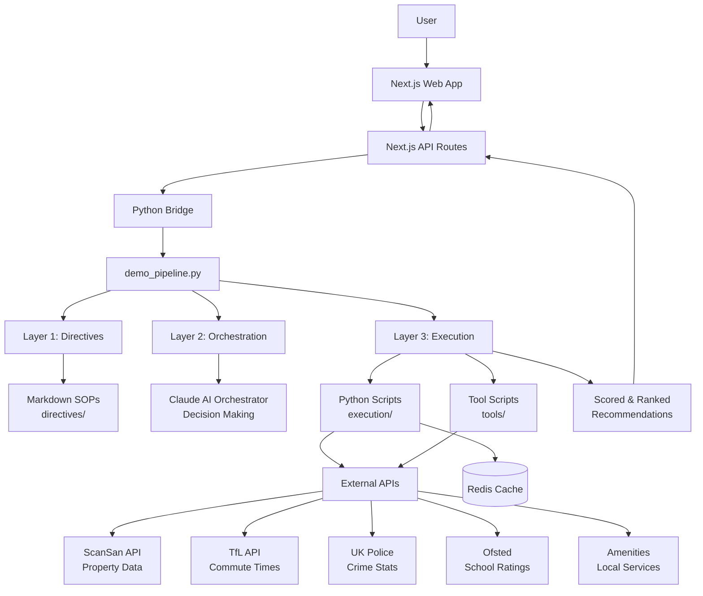

# Veo Housing Platform
> AI-powered property recommendation engine with persona-based scoring and intelligent multi-source data enrichment


---

## Description

Veo is an intelligent property recommendation system that helps users find the perfect London neighborhood based on their lifestyle and priorities. The platform leverages a sophisticated 3-layer AI orchestration architecture to synthesize live data from property intelligence APIs, transport networks, crime statistics, and education ratings—delivering personalized, data-driven area recommendations with transparent scoring and AI-generated explanations.

**Target Users:**
- **Students** seeking affordable areas with good transport links to universities
- **Parents** prioritizing school quality, safety, and family-friendly neighborhoods
- **Property Developers** looking for investment opportunities with high ROI potential

---

## Table of Contents

- [Features](#features)
- [Tech Stack](#tech-stack)
- [Architecture Overview](#architecture-overview)
- [Installation](#installation)
- [Usage](#usage)
- [Configuration](#configuration)
- [Screenshots / Demo](#screenshots--demo)
- [API / CLI Reference](#api--cli-reference)
- [Tests](#tests)
- [Roadmap](#roadmap)
- [Contributing](#contributing)
- [License](#license)
- [Contact / Support](#contact--support)

---

## Features

- **🎯 Persona-Driven Scoring** - Customized ranking algorithms for Students, Parents, and Property Developers with tailored factor weights
- **🏘️ Multi-Source Data Enrichment** - Integrates ScanSan property intelligence, TfL transport data, UK Police crime statistics, and Ofsted school ratings
- **🤖 AI-Powered Explanations** - Natural language justifications for every recommendation using Claude AI
- **📊 Transparent Factor Breakdown** - Clear visibility into affordability, commute, safety, amenities, and investment quality scores
- **⚡ Real-Time Analysis** - Live API calls ensure up-to-date property market data
- **🔄 Self-Annealing Architecture** - Automatically diagnoses and fixes API failures within the orchestration layer
- **🎨 Modern UI** - Beautiful, responsive interface built with Next.js, TypeScript, and Tailwind CSS
- **🧪 Comprehensive Testing** - Unit tests (Jest), integration tests, and E2E tests (Playwright)
- **📡 RESTful API** - Clean HTTP API with Zod validation and structured error responses

---

## Tech Stack

### Frontend
- **Framework**: Next.js 14 (App Router)
- **Language**: TypeScript 5.x
- **Styling**: Tailwind CSS
- **UI Components**: Custom components with Framer Motion animations
- **Validation**: Zod schemas

### Backend
- **Runtime**: Node.js 18+ (Next.js API Routes)
- **Language**: Python 3.11+ (data processing) + TypeScript (API layer)
- **AI/LLM**: Anthropic Claude (orchestration & natural language generation)
- **Data Processing**: Pandas, NumPy, aiohttp (async I/O)
- **Serverless**: Modal (Python serverless functions)

### External Services
- **Property Intelligence**: ScanSan API
- **Transport**: TfL Unified API
- **Crime Data**: UK Police Data API
- **School Ratings**: Ofsted API

### Testing
- **Unit Tests**: Jest with Testing Library
- **E2E Tests**: Playwright
- **Coverage**: Jest coverage reports

---

## Architecture Overview



### Architecture Explanation

The Veo platform follows a **3-layer architecture** that separates concerns to maximize reliability:

- **Layer 1 (Directives)**: Business logic defined in Markdown SOPs stored in [`directives/`](directives/). These act as natural language instructions for the AI orchestrator.

- **Layer 2 (Orchestration)**: Claude AI reads directives and makes intelligent routing decisions—determining which execution scripts to call, in what order, and how to handle errors.

- **Layer 3 (Execution)**: Deterministic Python scripts in [`execution/`](execution/) and [`tools/`](tools/) handle API calls, data processing, scoring algorithms, and database interactions. This layer is reliable, testable, and fast.

This architecture solves the problem of LLM unreliability: by pushing deterministic logic into Python scripts and using the LLM only for decision-making, the system achieves high accuracy and consistency.

---

## Installation

### Prerequisites

- **Node.js** 18+ and npm
- **Python** 3.11+
- **Redis** (optional, for caching)
- API keys for: ScanSan, TfL, Anthropic Claude (see [Configuration](#configuration))

### Step-by-Step Setup

#### 1. Clone the Repository

```bash
git clone https://github.com/younis-y/veo-housing-platform.git
cd veo-housing-platform
```

#### 2. Install Backend Dependencies (Python)

```bash
# Create and activate virtual environment
python -m venv venv

# On Windows
venv\Scripts\activate

# On macOS/Linux
source venv/bin/activate

# Install Python dependencies
pip install -r requirements.txt
pip install -r execution/requirements.txt
pip install -r tools/requirements.txt
```

#### 3. Install Frontend Dependencies (Node.js)

```bash
cd frontend
npm install
```

#### 4. Configure Environment Variables

```bash
# Copy template
cp .env.template .env

# Edit .env and add your API keys
```

Required environment variables:
```env
SCANSAN_API_KEY=your_scansan_key_here
ANTHROPIC_API_KEY=your_claude_key_here
TFL_API_KEY=your_tfl_key_here
```

#### 5. Verify Setup

```bash
# Test Python scripts
python demo_pipeline.py --persona student --budget 1000 --type rent --destination "UCL" --max-areas 5

# Start frontend dev server
cd frontend
npm run dev
```

Visit [`http://localhost:3000`](http://localhost:3000) to see the application running.

---

## Usage

### Web Interface

1. **Start the development server:**
   ```bash
   cd frontend
   npm run dev
   ```

2. **Open your browser** to [`http://localhost:3000`](http://localhost:3000)

3. **Fill in your preferences:**
   - Select a persona (Student, Parent, or Developer)
   - Enter your budget
   - Choose rent or buy
   - Optionally specify a destination for commute calculations

4. **View recommendations** with detailed factor breakdowns and AI-generated explanations

### CLI Demo Pipeline

Run the complete recommendation pipeline from the command line:

```bash
# Student looking for rental near UCL
python demo_pipeline.py \
  --persona student \
  --budget 1000 \
  --type rent \
  --destination "UCL" \
  --max-areas 5

# Parent looking to buy with school focus
python demo_pipeline.py \
  --persona parent \
  --budget 500000 \
  --type buy \
  --max-areas 10

# Developer analyzing investment opportunities
python demo_pipeline.py \
  --persona developer \
  --budget 1000000 \
  --type buy \
  --max-areas 15
```

### API Usage

Make HTTP requests to the Next.js API:

```bash
# Get recommendations
curl -X POST http://localhost:3000/api/recommendations \
  -H "Content-Type: application/json" \
  -d '{
    "persona": "student",
    "budget": 1000,
    "locationType": "rent",
    "destination": "UCL",
    "maxAreas": 5,
    "includeExplanations": true
  }'

# Get available personas
curl http://localhost:3000/api/personas

# Health check
curl http://localhost:3000/api/health
```

---

## Configuration

### Environment Variables

Create a `.env` file in the project root (use `.env.template` as a reference):

```env
# Required API Keys
SCANSAN_API_KEY=your_scansan_api_key
ANTHROPIC_API_KEY=your_claude_api_key
TFL_API_KEY=your_tfl_api_key

# Optional Configuration
REDIS_URL=redis://localhost:6379
PYTHON_EXECUTABLE=python3
NODE_ENV=development

# Feature Flags
NEXT_PUBLIC_USE_MODAL=false
NEXT_PUBLIC_USE_CACHE=true
```

### Persona Configuration

Default persona weights are defined in the scoring engine. To customize:

1. Edit [`execution/score_and_rank.py`](execution/score_and_rank.py)
2. Modify the `PERSONA_WEIGHTS` dictionary
3. Restart the application

Example persona weights:
```python
PERSONA_WEIGHTS = {
    "student": {
        "affordability": 35,
        "commute": 25,
        "safety": 15,
        "amenities": 20,
        "investmentQuality": 5
    }
}
```

---

## Screenshots / Demo

### Homepage - Persona Selection


### Results Page


### API Response Example


**Live Demo**: *Deployment URL coming soon*

---

## API / CLI Reference

### REST API Endpoints

The platform exposes a RESTful HTTP API. For complete API documentation, see [`API_DOCUMENTATION.md`](API_DOCUMENTATION.md).

#### POST `/api/recommendations`

Generate personalized area recommendations.

**Request:**
```json
{
  "persona": "student",
  "budget": 1000,
  "locationType": "rent",
  "destination": "UCL",
  "maxAreas": 5,
  "includeExplanations": true
}
```

**Response:**
```json
{
  "success": true,
  "persona": "student",
  "budget": 1000,
  "recommendations": [
    {
      "rank": 1,
      "areaCode": "E1",
      "areaName": "Whitechapel",
      "compositeScore": 87.5,
      "factorScores": {
        "affordability": 92,
        "commute": 85,
        "safety": 78
      },
      "strengths": ["Affordability", "Commute"],
      "weaknesses": ["Safety"],
      "explanation": "Whitechapel offers excellent value..."
    }
  ]
}
```

#### GET `/api/personas`

Get available persona definitions and their weight configurations.

#### GET `/api/health`

System health check and dependency validation.

### CLI Tools

#### Demo Pipeline

```bash
python demo_pipeline.py [OPTIONS]
```

**Options:**
- `--persona` - User persona: `student`, `parent`, or `developer`
- `--budget` - Monthly budget (rent) or total budget (buy)
- `--type` - Location type: `rent` or `buy`
- `--destination` - Destination for commute calculations
- `--max-areas` - Maximum number of areas to analyze (default: 5)

#### Area Data Fetcher

```bash
python execution/scansan_api.py [AREA_CODES...]
```

**Example:**
```bash
python execution/scansan_api.py E1 E2 SW1A N7
```

---

## Tests

The project includes comprehensive test coverage:

### Unit Tests

Run unit tests with Jest:

```bash
cd frontend
npm test                    # Watch mode
npm run test:unit          # Unit tests only
npm run test:ci            # CI mode with coverage
```

### Integration Tests

```bash
npm run test:integration
```

### End-to-End Tests

Run E2E tests with Playwright:

```bash
npm run test:e2e           # Run all E2E tests
npm run test:e2e:ui        # Run with UI mode
npm run test:e2e:debug     # Debug mode
```

### Coverage Reports

```bash
npm run test:coverage
```

Coverage reports are generated in `coverage/` directory.

### Test Documentation

For detailed testing documentation, see [`frontend/__tests__/README.md`](frontend/__tests__/README.md).

---

## Roadmap

### Phase 1: Core Platform ✅ (Complete)
- [x] 3-layer architecture implementation
- [x] Multi-source data integration (ScanSan, TfL, Crime, Schools)
- [x] Persona-based scoring engine
- [x] Next.js frontend with API routes
- [x] CLI demo pipeline
- [x] Python-TypeScript bridge
- [x] Zod validation and error handling
- [x] Unit and E2E tests

### Phase 2: Production Infrastructure 🔄 (In Progress)
- [ ] Modal serverless deployment
- [ ] Redis caching layer (Vercel KV)
- [ ] Rate limiting and queue management
- [ ] Monitoring and observability (Sentry, Axiom)
- [ ] Advanced error handling with retries
- [ ] OpenAPI/Swagger documentation

### Phase 3: Feature Expansion 📋 (Planned)
- [ ] Real-time rental listings integration (Rightmove, Zoopla)
- [ ] Interactive comparison tool
- [ ] Saved searches and email alerts
- [ ] User accounts and preference management
- [ ] Expansion beyond London (Manchester, Birmingham, etc.)
- [ ] Mobile-responsive PWA

### Phase 4: Advanced Intelligence 🔮 (Future)
- [ ] Historical trend analysis and price predictions
- [ ] Video explainers with narration
- [ ] Community insights and reviews
- [ ] Neighborhood virtual tours
- [ ] Investment ROI calculator with projections

---

## Contributing

We welcome contributions from the community! Here's how you can help:

### Getting Started

1. **Fork the repository** on GitHub
2. **Clone your fork** locally:
   ```bash
   git clone https://github.com/YOUR_USERNAME/veo-housing-platform.git
   cd veo-housing-platform
   ```
3. **Create a feature branch**:
   ```bash
   git checkout -b feature/amazing-feature
   ```
4. **Make your changes** and commit:
   ```bash
   git commit -m 'Add amazing feature'
   ```
5. **Push to your fork**:
   ```bash
   git push origin feature/amazing-feature
   ```
6. **Open a Pull Request** on GitHub

### Contribution Guidelines

- **Code Style**: Follow existing TypeScript/Python conventions
- **Tests**: Add tests for new features
- **Documentation**: Update relevant docs
- **Commit Messages**: Use clear, descriptive messages
- **PR Description**: Explain what, why, and how

### Areas for Contribution

- **Data Sources**: Add new API integrations
- **Personas**: Create new user personas with custom weights
- **UI Components**: Improve frontend design and UX
- **Performance**: Optimize data fetching and caching
- **Documentation**: Improve guides and examples
- **Bug Fixes**: Find and fix bugs (check [Issues](https://github.com/younis-y/veo-housing-platform/issues))

### Code of Conduct

Please be respectful and constructive in all interactions. We're building something great together!

---

## License

This project is licensed under the **MIT License**.

```
MIT License

Copyright (c) 2026 Veo Housing Platform

Permission is hereby granted, free of charge, to any person obtaining a copy
of this software and associated documentation files (the "Software"), to deal
in the Software without restriction, including without limitation the rights
to use, copy, modify, merge, publish, distribute, sublicense, and/or sell
copies of the Software, and to permit persons to whom the Software is
furnished to do so, subject to the following conditions:

The above copyright notice and this permission notice shall be included in all
copies or substantial portions of the Software.

THE SOFTWARE IS PROVIDED "AS IS", WITHOUT WARRANTY OF ANY KIND, EXPRESS OR
IMPLIED, INCLUDING BUT NOT LIMITED TO THE WARRANTIES OF MERCHANTABILITY,
FITNESS FOR A PARTICULAR PURPOSE AND NONINFRINGEMENT. IN NO EVENT SHALL THE
AUTHORS OR COPYRIGHT HOLDERS BE LIABLE FOR ANY CLAIM, DAMAGES OR OTHER
LIABILITY, WHETHER IN AN ACTION OF CONTRACT, TORT OR OTHERWISE, ARISING FROM,
OUT OF OR IN CONNECTION WITH THE SOFTWARE OR THE USE OR OTHER DEALINGS IN THE
SOFTWARE.
```

See [`LICENSE`](LICENSE) for more information.

---

## Contact / Support

### Maintainer

**Younis Y**  
GitHub: [@younis-y](https://github.com/younis-y)

### Project Links

- **Repository**: [https://github.com/younis-y/veo-housing-platform](https://github.com/younis-y/veo-housing-platform)
- **Issues**: [https://github.com/younis-y/veo-housing-platform/issues](https://github.com/younis-y/veo-housing-platform/issues)
- **Discussions**: [https://github.com/younis-y/veo-housing-platform/discussions](https://github.com/younis-y/veo-housing-platform/discussions)
- **Documentation**: See [`API_DOCUMENTATION.md`](API_DOCUMENTATION.md), [`BACKEND_README.md`](BACKEND_README.md), and [`ARCHITECTURE.md`](ARCHITECTURE.md)

### Getting Help

- **Bug Reports**: Open an issue with the `bug` label
- **Feature Requests**: Open an issue with the `enhancement` label
- **Questions**: Use GitHub Discussions or open an issue with the `question` label

### Community

- **Discord**: *Coming soon*
- **Twitter**: *Coming soon*

---

## Acknowledgments

- **ScanSan** for property intelligence API
- **Transport for London** for public transport data
- **UK Police** for crime statistics
- **Ofsted** for school ratings
- **Anthropic** for Claude AI powering the orchestration layer

---

## Project Status

🟢 **Active Development** - The project is under active development with regular updates.

**Latest Release**: v1.0.0 (Phase 1 Complete)  
**Next Milestone**: Phase 2 - Production Infrastructure  
**Last Updated**: January 31, 2026

---

## Additional Documentation

- **API Documentation**: [`API_DOCUMENTATION.md`](API_DOCUMENTATION.md)
- **Backend Guide**: [`BACKEND_README.md`](BACKEND_README.md)
- **Architecture Details**: [`ARCHITECTURE.md`](ARCHITECTURE.md)
- **Implementation Plan**: [`PLAN.md`](PLAN.md)
- **Testing Guide**: [`frontend/__tests__/README.md`](frontend/__tests__/README.md)
- **Agent Instructions**: [`AGENTS.md`](AGENTS.md), [`Claude_updated.md`](Claude_updated.md)

---

<div align="center">

**Made with ❤️ by the Veo Team**

If you find this project useful, please consider giving it a ⭐ on GitHub!

</div>
